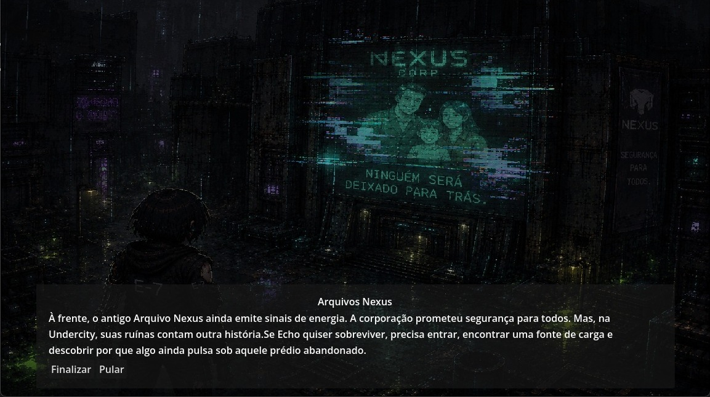
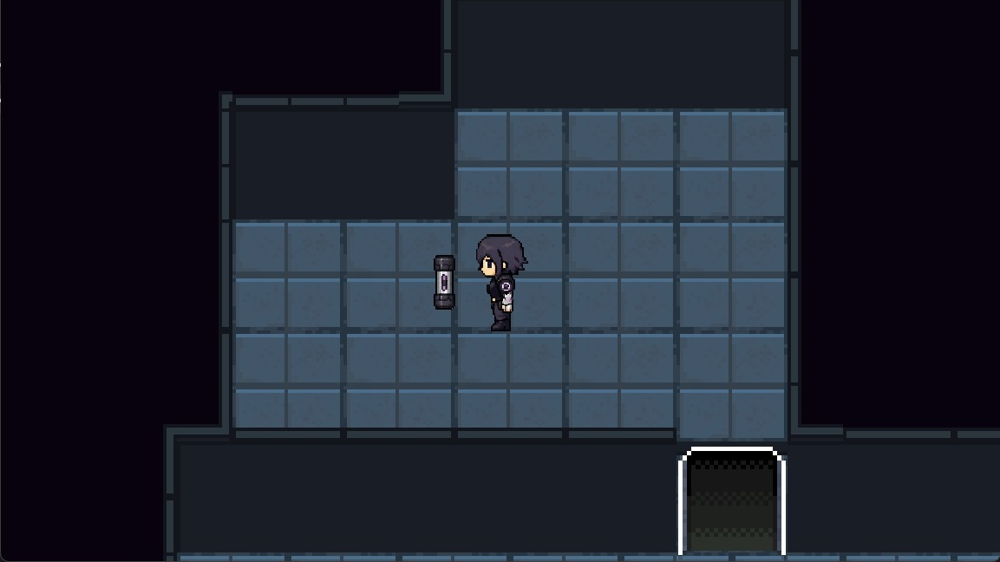
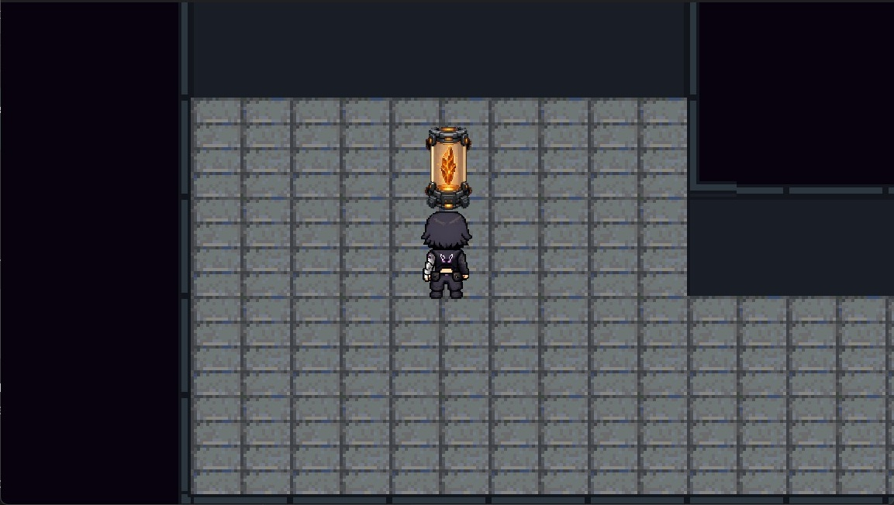

# Neon Roots



**Neon Roots** é um projeto acadêmico de jogo narrativo 2D top-down ambientado em um futuro cyberpunk em colapso, onde tecnologia, desigualdade social e degradação ambiental moldaram uma cidade dividida entre privilégio e abandono.

O jogador acompanha **Echo-7**, uma unidade sintética descartada pela Nexus Corp após se tornar obsoleta, que sobrevive na **Undercity** procurando energia, peças reaproveitáveis e formas de continuar funcionando.

Este repositório contém uma **POC jogável** de Neon Roots, desenvolvida para validar a base técnica, visual e narrativa do projeto em contexto acadêmico.

---

## Sobre o Projeto

Neon Roots nasceu como uma proposta de jogo relacionada aos **Objetivos de Desenvolvimento Sustentável (ODS)**, com foco em criatividade, sustentabilidade, narrativa ambiental e conscientização social.

A ideia central do jogo completo é transformar os **17 ODS da ONU** em **17 fragmentos narrativos**, cada um associado a uma dimensão emocional, ambiental e social do mundo.

A proposta não é explicar os ODS de forma expositiva ou didática durante a gameplay. Em vez disso, o jogo busca fazer o jogador perceber suas ausências por meio de:

* ambientes degradados;
* desigualdade entre regiões da cidade;
* escassez de energia, água e alimento;
* abandono de pessoas, máquinas e comunidades;
* uso da tecnologia como ferramenta de controle;
* restauração gradual de espaços antes destruídos;
* contraste entre natureza, sucata e infraestrutura urbana.

No jogo idealizado, cada fragmento recuperado altera a forma como **Neo**, uma consciência fragmentada ligada ao Gaia Core, interpreta o mundo. Assim, os ODS deixam de ser apenas temas externos e passam a influenciar personagem, cenário, narrativa e progressão.

---

## Observação sobre o Escopo da POC

Esta versão **não representa uma demo completa do jogo final**.

A versão disponível neste repositório é uma **prova de conceito jogável**, curta e limitada, desenvolvida para apresentar a base do projeto e validar alguns de seus elementos principais:

* movimentação top-down;
* câmera acompanhando o personagem;
* exploração simples;
* interação contextual;
* coleta de item;
* puzzle inicial;
* transição de espaços;
* apresentação visual da Undercity;
* introdução narrativa ao universo de Neon Roots;
* primeiro contato com a ideia dos fragmentos.

Por conta do tempo e do escopo acadêmico, muitos elementos centrais do conceito completo ainda não estão implementados nesta versão, como:

* os 17 fragmentos;
* evolução completa de Neo;
* múltiplos distritos;
* escolhas narrativas;
* restauração ambiental progressiva;
* sistemas avançados de energia;
* stealth;
* progressão corporal de Echo-7;
* presença mais evidente dos ODS na gameplay.

A POC deve ser entendida como uma primeira materialização do conceito: um recorte jogável simples que apresenta Echo-7, a Nexus, a Undercity, a atmosfera do projeto e a promessa narrativa do jogo completo.

---

## Criatividade e Sustentabilidade

Neon Roots foi desenvolvido a partir dos pilares de **criatividade** e **sustentabilidade** propostos pelo desafio acadêmico.

A **criatividade** aparece na forma como o projeto transforma temas sociais e ambientais em uma experiência de ficção cyberpunk. Em vez de apresentar os ODS como tópicos de aula, o jogo propõe um mundo onde a ausência desses objetivos pode ser sentida nos cenários, nos conflitos, nos personagens e nas mecânicas planejadas.

A **sustentabilidade** aparece como parte estrutural da narrativa. O mundo de Neon Roots é marcado por degradação ambiental, desigualdade, obsolescência programada, descarte de máquinas e abandono de comunidades inteiras. A jornada de Echo-7 e Neo representa a tentativa de reconstruir esse mundo não por meio de uma solução mágica, mas por cuidado, reaproveitamento, memória, justiça e restauração gradual.

---

## História

Em **Nexus Prime**, a cidade foi dividida entre dois mundos.

Acima, existe **Aurora**, região limpa, iluminada e privilegiada, mantida por tecnologia avançada e controle corporativo.

Abaixo, existe a **Undercity**, onde vivem os descartados: trabalhadores esquecidos, comunidades marginalizadas, máquinas obsoletas, sucata industrial e corpos que a cidade decidiu não enxergar.

Nesse contexto, a Nexus Corp criou unidades sintéticas industriais para operar em ambientes tóxicos e perigosos. Entre elas estava o **Lote 7**, uma linha de máquinas feitas para suportar condições que humanos comuns não sobreviveriam.

**Echo-7** fazia parte desse lote.

Ela não foi criada para ser heroína. Não foi criada para liderar uma revolução. Não foi criada para escolher o próprio destino.

Foi criada para trabalhar.

Com o tempo, suas peças se desgastaram, seus sensores falharam, sua eficiência caiu e ela foi considerada obsoleta. Como qualquer ferramenta que deixou de ser lucrativa, Echo-7 foi descartada.

Anos depois, sobrevivendo entre sucata, cabos queimados e raros pontos de energia, Echo encontra um fragmento anômalo ligado ao **Gaia Core**, uma tecnologia esquecida capaz de restaurar partes do mundo degradado.

Esse contato desperta **Neo**, uma consciência instável, fragmentada e irônica, que passa a acompanhar Echo em sua jornada.

A partir desse encontro, Echo deixa de apenas procurar carga para continuar funcionando. Aos poucos, ela começa a procurar respostas, memória, pertencimento e uma forma de existir que não tenha sido determinada pela Nexus.

---

## Visão Idealizada do Jogo Completo

O jogo completo de Neon Roots é planejado como um **RPG narrativo top-down**, estruturado em torno da coleta de **17 fragmentos**, cada um inspirado em um dos **17 Objetivos de Desenvolvimento Sustentável da ONU**.

Cada fragmento representa não apenas um tema social ou ambiental, mas uma consciência simbólica que modifica a percepção de Neo e altera o mundo ao redor de Echo.

Entre os temas planejados estão:

* pobreza, abandono e dignidade;
* fome, nutrição e agricultura sustentável;
* saúde, cuidado e bem-estar;
* educação, conhecimento e memória;
* igualdade, autonomia e reconhecimento;
* água potável e saneamento;
* energia limpa e acessível;
* trabalho digno e exploração;
* infraestrutura e inovação;
* redução das desigualdades;
* cidades sustentáveis;
* consumo responsável;
* ação climática;
* vida na água;
* vida terrestre;
* justiça e instituições;
* parcerias e reconstrução coletiva.

A campanha idealizada acompanha a evolução de Echo-7 e Neo em paralelo.

Echo começa como uma unidade sintética descartada, preocupada apenas em conservar energia e sobreviver. Ao longo da jornada, ela passa a reconstruir o próprio corpo com peças reaproveitadas, não para voltar ao modelo original, mas para se tornar algo escolhido por ela mesma.

Neo começa como uma consciência fragmentada, instintiva e incompleta. A cada fragmento, ele recupera uma nova forma de interpretar o mundo: acolher, nutrir, curar, perguntar, resistir, iluminar, reconectar, lembrar, julgar e coexistir.

A história de Neon Roots não é apenas sobre salvar o mundo. É sobre uma máquina descartada descobrindo que sobreviver não basta.

---

## Estrutura Narrativa Planejada

A campanha completa foi idealizada em partes, cada uma explorando diferentes distritos de Nexus Prime e diferentes dimensões dos ODS.

### Parte 0 — Abertura / Introdução

**Tema:** abandono, sobrevivência e dignidade.
**Local:** Periferias da Undercity / Arquivo Abandonado da Nexus.
**Fragmento inicial:** ligado à ideia de pobreza, descarte e dignidade.

Echo-7 desperta com pouca energia e entra em um antigo prédio de arquivos da Nexus em busca de uma fonte de carga. Lá, encontra o primeiro fragmento e desperta Neo.

Essa parte estabelece o núcleo emocional do jogo:

* Echo não quer salvar o planeta;
* Neo ainda não está inteiro;
* a Undercity não precisa de discursos, precisa de cuidado.

### Partes Futuras

As partes seguintes expandiriam a jornada para outros distritos da cidade, como laboratórios agrícolas, setores médicos, sistemas de água, núcleos de energia, ferrovias abandonadas, centros de dados, zonas industriais, prisões corporativas e áreas ambientais preservadas artificialmente.

Cada região apresentaria um problema social, ambiental ou estrutural ligado aos ODS, sempre tratado por meio de exploração, narrativa ambiental, puzzles, investigação e transformação do cenário.

---

## POC Jogável Atual

A POC atual apresenta um recorte simples do início dessa proposta.

### Fluxo principal

```text
Menu
↓
Introdução narrativa
↓
Echo-7 explora o ambiente
↓
Coleta um fusível
↓
Interage com sistemas do cenário
↓
Resolve um puzzle simples
↓
Acessa uma nova área
↓
Encontra o primeiro fragmento
↓
Encerramento da POC
```

### Objetivo da POC

Demonstrar a base inicial de Neon Roots:

* personagem controlável;
* movimentação em quatro direções;
* câmera top-down;
* mapa navegável;
* interação contextual;
* item coletável;
* puzzle simples;
* uso de HUD/interface;
* atmosfera cyberpunk;
* introdução ao universo narrativo;
* primeira representação visual dos fragmentos.

---

## Capturas da POC

### Exploração e coleta de item



### Primeiro fragmento



---

## Gênero e Perspectiva

* **Gênero:** RPG narrativo atmosférico
* **Perspectiva:** 2D top-down tile-based
* **Movimentação:** 4 direções
* **Câmera:** Camera2D acompanhando Echo-7
* **Foco planejado:** exploração, investigação, narrativa ambiental e puzzles

A perspectiva top-down foi escolhida por favorecer a leitura espacial do ambiente, a exploração de salas e corredores, a interação com objetos e a construção de puzzles simples.

---

## Tecnologias e Ferramentas Utilizadas

### Desenvolvimento

- [Godot Engine 4.x](https://godotengine.org/)
- GDScript

### Versionamento

- Git
- GitHub

### Arte, Assets e Edição Visual

- [itch.io](https://itch.io/) — pesquisa e uso de assets para prototipação
- [Photopea](https://www.photopea.com/) — edição e tratamento de imagens

### Apoio Criativo e Produção

- ChatGPT — apoio na geração de imagens, organização de ideias, documentação, roteiro, estruturação narrativa e suporte durante o desenvolvimento
---

## Download da POC Jogável

A versão executável da POC está disponível na aba **Releases** deste repositório.

> O arquivo jogável não está armazenado diretamente no repositório para evitar que o histórico do Git fique pesado.  
> O código-fonte, documentação e imagens permanecem versionados normalmente, enquanto o build compactado é disponibilizado separadamente como artefato de release.

🔗 [Baixar Neon Roots - POC Jogável](https://github.com/zetastudioteam/neon-roots/releases/tag/v0.1-poc)

---

## Como Executar

### Jogar a POC

1. Acesse a aba **Releases** deste repositório.
2. Baixe o arquivo compactado da versão mais recente.
3. Extraia o arquivo `.zip`.
4. Execute o arquivo do jogo.

> A build disponibilizada foi exportada para Windows.

### Abrir o Projeto na Godot

1. Baixe e instale a **Godot Engine 4.x**.
2. Clone este repositório.
3. Abra a Godot.
4. Selecione a opção **Importar**.
5. Escolha o arquivo `project.godot` dentro da pasta do projeto.
6. Execute a cena principal.

Caso o projeto esteja organizado dentro da pasta `game/`, importe o arquivo:

```text
game/project.godot
```
---

## Controles

| Ação                | Tecla |
| ------------------- | ----- |
| Mover para cima     | W     |
| Mover para baixo    | S     |
| Mover para esquerda | A     |
| Mover para direita  | D     |
| Interagir           | E     |

---

## Estrutura de Pastas

```text
game/
├── assets/
│   ├── art/
│   ├── audio/
│   ├── fonts/
│   └── localization/
│
├── scenes/
│   ├── core/
│   ├── echo7/
│   ├── neo/
│   ├── environments/
│   ├── props/
│   ├── systems/
│   └── menus/
│
├── scripts/
│   ├── core/
│   ├── echo7/
│   ├── systems/
│   ├── neo/
│   ├── ui/
│   └── tools/
│
├── resources/
│   ├── dialogue/
│   ├── configs/
│   └── tilemaps/
│
└── builds/
```

---

## Escopo Atual

Esta versão está focada apenas em uma POC jogável.

### Implementado ou previsto para esta fase

* movimentação de Echo-7;
* câmera acompanhando o jogador;
* mapa inicial;
* sistema de interação;
* coleta de item;
* puzzle simples;
* primeiro fragmento;
* telas narrativas;
* atmosfera visual inicial.

### Fora do escopo desta versão

* jogo completo;
* 17 fragmentos jogáveis;
* múltiplos arcos;
* mundo aberto;
* inventário complexo;
* crafting;
* multiplayer;
* skill tree;
* IA complexa;
* combate avançado;
* múltiplos finais;
* restauração ambiental completa;
* progressão corporal avançada de Echo-7.

---

## Organização de Branches

```text
main
develop
feature/*
```

### Regras

* Nunca desenvolver diretamente na `main`.
* A branch `main` deve conter apenas versões estáveis.
* O desenvolvimento diário deve acontecer na `develop`.
* Novas funcionalidades devem ser feitas em branches `feature/*`.

Exemplos:

```text
feature/player-movement
feature/map-transition
feature/interaction-system
feature/hud-base
```

---

## Convenção de Commits

Utilizar commits curtos e descritivos.

Prefixos recomendados:

```text
feat: nova funcionalidade
fix: correção de bug
art: assets visuais
audio: sons e músicas
docs: documentação
refactor: refatoração de código
```

Exemplos:

```text
feat: adiciona movimentação da Echo
fix: corrige colisão da porta inicial
art: adiciona tileset temporário da Undercity
audio: adiciona ambiência industrial
docs: atualiza README com estrutura do projeto
```

---

## Definition of Done

Uma tarefa só deve ser considerada concluída quando:

* funciona corretamente;
* foi testada;
* não quebra outra funcionalidade;
* está commitada;
* foi integrada na branch `develop`;
* possui feedback visual mínimo quando necessário.

---

## Equipe

| Nome    | Papel               |
| ------- | ------------------- |
| Bruna   | Product Owner       |
| Bruno   | Gameplay Programmer |
| Nicolas | Systems Programmer  |
| Pedro   | Environment Artist  |
| Suelen  | Character/UI Artist |
| Ryan    | Sound Designer      |

---

## Contexto do Evento

Neon Roots foi desenvolvido como um projeto paralelo e opcional para um evento acadêmico associado ao Dia do Meio Ambiente, realizado em 2 de junho.

A proposta do evento era desenvolver um jogo utilizando como base os temas dos Objetivos de Desenvolvimento Sustentável (ODS), explorando criatividade, sustentabilidade e conscientização social por meio de uma experiência interativa.

A partir desse desafio, Neon Roots foi idealizado como uma POC jogável em formato de RPG narrativo top-down, ambientado em um futuro cyberpunk marcado pela desigualdade, pelo descarte tecnológico e pela degradação ambiental.

> Embora a versão atual seja curta e limitada, ela apresenta a base conceitual do projeto: Echo-7, a Undercity, a Nexus, o primeiro fragmento e a ideia de um mundo que pode ser restaurado a partir da relação entre tecnologia, memória e natureza.
---

## Status do Projeto

Projeto em versão **POC jogável**.

O objetivo desta versão é apresentar o conceito central de Neon Roots e validar uma primeira base técnica, visual e narrativa para possível desenvolvimento futuro.

> A POC foi criada para o evento do Dia do Meio Ambiente como uma experiência curta baseada nos temas dos ODS.
---

## Créditos e Licença

Este projeto está em desenvolvimento acadêmico.

Parte dos materiais utilizados pode incluir assets temporários, gratuitos ou de uso permitido para prototipação, com seus devidos créditos quando aplicável.

A licença definitiva do projeto ainda será definida antes de qualquer lançamento público ou comercial.
